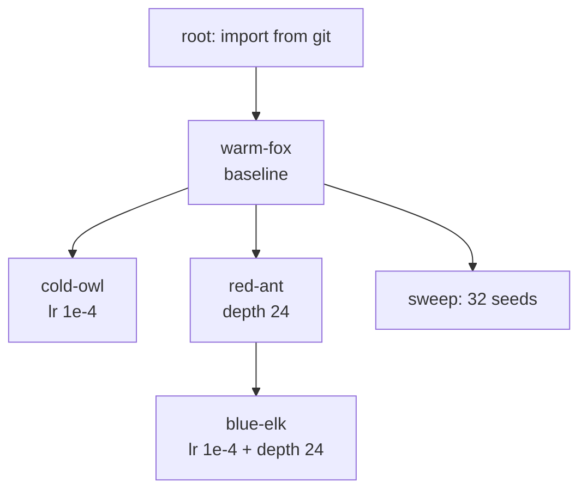
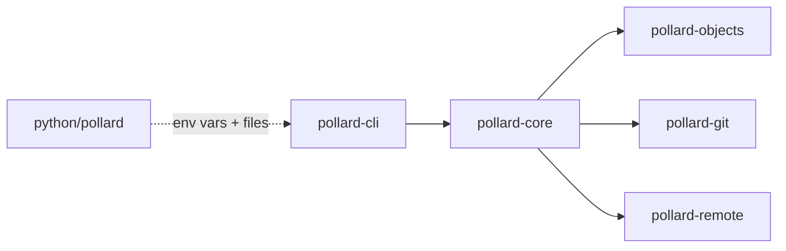

# pollard: tree-based experiment VCS — implementation spec (v3)

2026-09-18 · @Someone

## 1. Purpose, scope, naming

Build **pollard**, a version-control tool for deep-learning research where history is a **tree of runs**, not a git graph. Pollarding is cutting a tree back so it sends out many new shoots from the same trunk; that is the workflow: fork, try, prune, fork again. Every training launch becomes an immutable node with one parent. There are no branches, no staging area, no merges, and no required commit messages.

**Deliverables.** A Rust core (CLI + library crates) and an optional pure-Python package. Git is a backend for code snapshots and an export target, not something the user touches day to day.

**In scope.** Node storage; `run`, `fork`, `diff`, `siblings`, `tree`, `prune`, `pin`, `note`, `apply`, `undo`; chunk-deduplicated checkpoint storage; metric streams with inheritance across forks; sibling diff; off-tree document files; git export/import; remote sync to S3-compatible storage; first-class uv integration.

**Out of scope for v1.** Web UI, job scheduling, permissions, dashboards, merges of any kind. Metrics may be forwarded to W&B or Neptune through an optional hook: pollard owns the tree, they own the charts.

**Naming.** Binary `pollard`, alias `po` (installed alongside; `po` is the form users type day to day, so all examples in this spec are valid with `po` in place of `pollard`). Subcommand short form: `sib` for `siblings`. Repo directory `.pollard/`, ignore file `.pollardignore`, export recipe file `.pollard-recipe.json`. Crates `pollard-core`, `pollard-objects`, `pollard-git`, `pollard-remote`, `pollard-cli`. Python package: PyPI distribution `pollard-vcs` (the name `pollard` is taken on PyPI), import name `pollard` (`import pollard`). On crates.io `pollard` is also taken; the crate names above are free, and the binary crate is `pollard-cli`. Environment variables `POLLARD_NODE_ID`, `POLLARD_FORK_STEP`, `POLLARD_METRICS`, `POLLARD_CKPT_DIR`, `POLLARD_CONFIG`. Checked 2026-09-18: no `po` binary on Ubuntu/Debian default PATH or in Homebrew.

## 2. Core concepts

A **node** is one run: an immutable record of what was launched and what came out. A node has exactly one parent; the root has none. Position in the tree is identity; there are no branch names.

A node splits into two parts:

- **Recipe** = `(code, config, data, env)`, four content hashes. Two nodes with the same recipe are the same experiment. Recipes are tiny and never deleted.
- **Outcome** = `weights`, `metrics`, `status`, `note`, `docs`. Outcomes can be pruned; the recipe stays so any outcome can be reproduced.

The **working copy** is the user's checkout directory. `pollard run` snapshots it into a new node, then launches. `pollard fork <node>` makes the working copy match that node's recipe.

**Off-tree files** are project-level documents (reports, idea logs) that live in the working copy but are not part of any recipe. They are snapshotted for reference, never diffed by default, and never move on `fork`.

The **tree** is the log. Its default view collapses dead subtrees and highlights the best path by a chosen metric. A **sweep** is a node whose children are a fan-out set, rendered as one row with a table behind it.

The **op log** records every mutating command so `pollard undo` can restore the previous repo state, as in Jujutsu.



Reading: every edge is "forked from". blue-elk was made by forking red-ant and applying cold-owl's change; there is no merge node.

## 3. Data model

All state lives under `.pollard/` in the project root: `db.sqlite` (nodes, ops, metrics), `objects/` (small content-addressed blobs), `chunks/` (CDC chunks for large files), `config.toml`, `lock`.

### Node record

| Field | Type | Meaning |
| --- | --- | --- |
| id | text, PK | Human-friendly, e.g. `warm-fox-7`: `<adjective>-<noun>-<counter>`. `counter` is a per-clone sequential integer. The word pair is taken from `blake3(clone_salt ‖ counter)` indexing the built-in word lists. `clone_salt` is a random 64-bit value created at `init`/clone. |
| parent | text, nullable | Parent node id; null only for roots |
| code | git tree hash | Hash of the code tree (see §7 for why git hashing); its blake3 code manifest is found through `code_trees` |
| sweep | text, nullable | Sweep name set by `run --sweep`; members are ordinary children of the current node |
| config | blake3 hex | Hash of the canonical JSON of the resolved config |
| data | blake3 hex | Hash of the dataset manifest list |
| env | blake3 hex | Hash of `uv.lock` (or `uv pip freeze` when absent) + Python version + CUDA/driver string; see §4 |
| recipe\_hash | blake3 hex, indexed | blake3(code ‖ config ‖ data ‖ env); used for duplicate detection |
| weights | blake3 hex, nullable | Hash of the checkpoint/artifact manifest; null until something is saved |
| docs | blake3 hex, nullable | Manifest hash of off-tree files at run time; outside the recipe |
| fork\_step | integer, nullable | Step inherited from the parent when forked with `--step` |
| status | enum | `running`, `done`, `failed`, `killed`, `pruned` |
| created\_at, finished\_at | timestamp | UTC |
| command | text | The exact launch command |
| note | text, nullable | First line is the short message shown in `tree`; further lines are the body. Auto-generated from the config delta when the user gives none, flagged `auto`. Only mutable field. |
| lock\_ok | bool, nullable | Result of `uv lock --check` at run time |

### Manifests

A manifest is a sorted list of `(relative path, size, blake3 hash, mode)` lines, hashed as a whole and stored as a small object. Code, data, weights, and docs use the same format.

**Code manifest.** Respects `.gitignore` and `.pollardignore`; excludes `.pollard/`, `.git/`, off-tree files, output directories, the checkpoint directory, and any file over 10 MB (logged as a warning and treated as data).

**Data manifest.** Data roots are declared in `config.toml` (`data = ["./data", "s3://bucket/prefix"]`). Local roots list files; remote roots list `(key, size, etag)`. Manifests are cached by `(root, mtime, size)` and only changed entries are rehashed, so a 1 TB local dataset does not block every run.

**New and untracked files.** There is no staging step. Every non-ignored file present at `pollard run` time is in that node's code manifest, including files git considers untracked. Files created after launch belong to the next node. Files the script writes during a run are outcomes, not code: checkpoints go to `POLLARD_CKPT_DIR`; other outputs go to a directory listed under `output_dirs` (default `outputs/`, auto-ignored) or are attached with `pollard artifact <path>`, which stores them under the weights manifest. `run` warns when it sees new files over 10 MB or more than 500 new files since the parent.

**Off-tree files.** `config.toml` lists `offtree = [...]` (paths or globs with gitignore semantics, including `!` negation; default `["*.md", "notes/"]`, so `README.md` is off-tree unless the user adds `!README.md`). Excluded from the code manifest and the recipe, so editing them never produces a code delta, never affects `siblings`, and never bypasses the duplicate check. Snapshotted at each `run` into the `docs` hash so `show` can display what the report said at the time. `fork` leaves them untouched; `export` includes them in the git commit; `diff --docs` shows their changes on request. A path matched by both `offtree` and config capture is config.

### SQLite tables

- `nodes`: the record above plus `depth` for fast tree queries.
- `pins`: `(name PK, node_id)`.
- `ops`: `(op_id, ts, command, before_snapshot, after_snapshot, wc_snapshot)`. A snapshot is a blob of `nodes` + `pins`. `wc_snapshot` (nullable) is the manifest hash of the working copy's code-scoped files, taken before any op that writes the working copy (`fork`, `apply`, `undo`), and `undo` restores it. This is the undo log.
- `code_trees`: `(git_tree PK, manifest_hash)` maps a node's `code` git tree hash to its blake3 code manifest.
- `deltas`: `(node_id PK, config_delta, code_delta, data_delta, env_delta)` as JSON, computed at creation against the parent. Powers sibling diff.
- `metrics`: `(node_id, key, step, value REAL, ts)`, indexed on `(node_id, key, step)`. Only points logged by this node; inherited points are resolved through the parent chain at read time.
- `objects`: `(hash PK, size, kind)`.
- `chunks`: `(hash PK, size, refcount)` and `chunk_map (file_hash, ordinal, chunk_hash)`.

### Object and chunk stores

`objects/ab/cdef…` holds any blob under 1 MB, zstd level 3. `chunks/ab/cdef…` holds CDC chunks (target 64 KB, min 8 KB, max 128 KB, gear rolling hash via the `fastcdc` crate's v2020 algorithm). A file over 1 MB is stored as a chunk map, never whole (M1–M3 may store it whole behind the same API until M4). Refcounts update on node creation and prune; `pollard gc` deletes chunks with refcount 0. `gc` is the point of no return: `undo` of a `prune` after `gc` restores the nodes but warns that the weights are gone (the recipe still reproduces them).

## 4. CLI, run protocol, Python SDK, uv

The CLI is the full feature set. Every mutating command writes an op-log entry first and prints the id of the node it created or changed on its last line.

### Commands

| Command | Behavior |
| --- | --- |
| `pollard init [--from-git]` | Create `.pollard/`, add it to `.gitignore`. With `--from-git`, import HEAD as the root node. |
| `pollard run [-m <text>]... [--parent <node>] [--sweep <name>] [--force] [--strict] <cmd...>` | Snapshot code/config/data/env/docs, create a child of the current node, set the protocol env vars, exec `<cmd>`, tail metrics, register checkpoints, set status on exit. Refuses if `recipe_hash` matches an existing node with status `running` or `done` unless `--force`; matches that are `failed`, `killed`, or `pruned` only print a notice naming them, so a crashed run can be relaunched as is. `-m` sets the note; repeat for paragraphs; `-m -` reads from stdin; no `-m` → auto note from the config delta. `--sweep` marks a fan-out member. |
| `pollard fork <node> [--step N] [--no-sync]` | Restore code and config to `<node>`, set it current, run `uv sync --frozen` unless `--no-sync`. With `--step N`, restore the checkpoint at step N into `POLLARD_CKPT_DIR` and record `fork_step`. A checkpoint's step is the last run of digits in its file name (`step30000.pt` → 30000); files without digits are not step-addressable. The lookup searches the node and then its ancestors, following the same inheritance rule as metrics (§5). If no checkpoint is exactly at N, the largest step ≤ N is used, `fork_step` is set to that step, and a notice is printed. Working-copy changes are saved to the op log (`wc_snapshot`) first, never lost. Off-tree files are untouched. |
| `pollard diff <a> <b> [--docs]` | Side-by-side code, config, data, env, metric deltas. Siblings default to the parent-relative view (§6). |
| `pollard siblings [<node>] [--metric k] [--expand-sweeps] [--json]` | Sibling table for a node's children. Default: the current node's parent. |
| `pollard tree [--metric k] [--all]` | Render the tree. Collapses pruned and failed subtrees unless `--all`; highlights the best path when `--metric` is given; sweeps render as one row. |
| `pollard show <node>` | Full record, recipe hashes, note, metric summary, checkpoints, and the one-liner to rebuild the env. |
| `pollard prune <node> [--keep-weights]` | Mark subtree `pruned`, drop weight refcounts. Recipe, deltas, metrics stay. |
| `pollard pin <node> <name>` / `unpin <name>` | Named pointer. There is no auto-prune; nodes are only pruned by an explicit `prune`. |
| `pollard note <node> [<text>] [-e]` | Set or replace the note; `-e` opens `$EDITOR`. |
| `pollard apply <node>` | Apply `<node>`'s code delta (its diff from its own parent) to the working copy as a patch. Conflicts are left as markers; exit 0 with a warning. |
| `pollard log <node> [--key k]` | Print a metric stream with inherited points resolved. |
| `pollard ckpt <path>` / `pollard artifact <path>` | Register a checkpoint or other output now, from inside a running script. |
| `pollard undo [n]` / `pollard op log` | Restore repo state to before the last n ops. |
| `pollard export <node> [--path a..b] [--branch name]` | Write git commits (§7). |
| `pollard import <git-rev>` | Create a root node from a git commit. |
| `pollard push` / `pull` | Sync with the remote (§5). |
| `pollard gc [--auto]` | Delete unreferenced chunks and objects. |

Node arguments accept a full id, a unique prefix, a pin name, `@` for the current node, or `@-` for its parent.

### Run protocol (the real contract)

A training process needs no library. `pollard run` sets these variables and watches two paths:

| Variable | Meaning |
| --- | --- |
| `POLLARD_NODE_ID` | The node this process is. |
| `POLLARD_FORK_STEP` | Integer step to resume from, or unset. |
| `POLLARD_METRICS` | Path to an append-only JSONL file. Each line is `{"step": int, "<key>": number, ...}`. The CLI tails it during the run and ingests into `metrics`; on exit it ingests any remainder. |
| `POLLARD_CKPT_DIR` | Directory for checkpoints: `checkpoint_dir` in `config.toml`, default `ckpt/`, auto-ignored from the code manifest. Files that appear here are chunked and added to the weights manifest at run end, or immediately via `pollard ckpt <path>`. |
| `POLLARD_CONFIG` | Optional: path to a JSON file the script may write before its first metric line, used when config capture mode is `sdk`. |

This works for Python, JAX, Julia, C++, or shell. Config capture mode is set in `config.toml` as `hydra` (read the composed config from the Hydra job), `file:<path>` (a YAML/JSON file in the working copy), or `sdk` (`POLLARD_CONFIG`). Default: `file:config.yaml` if present, else `sdk`.

### Python SDK (optional, pure Python)

No compiled extension; it only reads the env vars and writes the protocol files. Target under 200 lines. Everything must remain achievable without it.

```python
import pollard

run = pollard.current()               # raises if not launched via `pollard run`
run.log({"val_loss": 2.31}, step=10_000)
run.save_checkpoint("ckpt/step10000.pt")
run.set_config(cfg_dict)              # only in `sdk` capture mode
pollard.fork_step()                   # int or None
pollard.siblings("warm-fox-7")        # DataFrame if pandas is present
```

Optional extras: `pollard.forward("wandb")` or `"neptune"` mirrors every `log` call and records the foreign run id in the note.

### uv integration

uv is the assumed Python toolchain; plain `pip` works but gets a weaker env hash.

- **Install.** `uv tool install pollard-vcs` (the wheel bundles the Rust binary) or `cargo install pollard-cli`.
- **Env hash.** With `uv.lock`: blake3 of `uv.lock` + `.python-version` + `requires-python` + CUDA/driver string. Without: blake3 of `uv pip freeze` output plus the same strings. A PEP 723 script's inline `# /// script` block is appended.
- **Launch.** If the first argument is a `.py` file and no interpreter is named, run it as `uv run <file>` when `pyproject.toml` or `uv.lock` exists, else `python <file>`. `pollard run -- uv run train.py` is always accepted verbatim.
- **Lock check.** Run `uv lock --check` before hashing; warn on failure, refuse with `--strict`. Record the result in `lock_ok`.
- **Fork.** Restores `uv.lock` with the code tree, then `uv sync --frozen` unless `--no-sync`.
- **Reproduce.** `pollard show` prints `pollard fork <node> && uv sync --frozen`.

## 5. Storage tiers and sync

Three tiers share one blake3 address space so a node can reference any of them by hash.

**Tier 1, small objects.** Manifests, configs, code files under 1 MB, deltas. Stored whole, zstd level 3. Kilobytes per node.

**Tier 2, chunked blobs.** Checkpoints, datasets, artifacts, any file over 1 MB. Content-defined chunking with a gear rolling hash, target 64 KB, bounds 8–128 KB. Sibling checkpoints that share most parameters share most chunks. Chunking uses the `fastcdc` crate (MIT, v2020 `StreamCDC`). The xet-core crates were rejected: they are Apache-2.0, but the chunker is internal ("do not use directly") and they pull in a network client and tokio. Chunks are packed into 64 MB pack files for remote transfer, stored individually on local disk in v1.

**Tier 3, metric streams.** Rows in `metrics`, append-only per node. Reading key `k` for a node walks up the parent chain: for each link with `fork_step` set, include the ancestor's points with `step <= fork_step`; stop at the first link without one. A node may log a key its parent never logged.

**Fork-step monotonicity** (from Neptune): if the user forks X at step N but X was forked from Y at step M and N < M, set the new node's parent to the ancestor that actually logged step N, and print a one-line notice. The fork then behaves exactly like `fork <that ancestor> --step N`: the working copy gets that ancestor's recipe and checkpoint, because that is the recipe that produced step N, so the parent and the working copy agree and deltas stay meaningful.

**Remote.** One remote per repo in `config.toml`: an S3-compatible URL or a local path. Layout mirrors `.pollard/`: `objects/`, `packs/`, `nodes.jsonl` (append-only), `pins.json`. `push` uploads new objects and packs, then appends node lines; `pull` reverses. Node records are immutable so there are no conflicts; `note` and `pins` are last-writer-wins. Ids are salted per clone (§3), so two people creating children of the same parent collide only with probability about 1 in 4 million per same-counter pair. `pull` refuses a remote node whose id already exists locally with a different recipe, and names both.

**Locality.** `tree`, `siblings`, `diff`, `show` hit SQLite and Tier 1 only. Tier 2 is touched by `fork --step`, `ckpt`, `artifact`, `push`, `pull`, and `gc`.

## 6. Sibling diff

Siblings are never diffed against each other. Each is diffed against the shared parent once, at creation; the sibling view is a join over those cached deltas.

### Step 1: parent-relative deltas (computed in `run`, stored in `deltas`)

- `config_delta`: structural diff of two canonical JSON configs → list of `{path, old, new}` with dotted paths like `model.depth`. Arrays compare by index; one-sided keys get `null`.
- `code_delta`: manifest diff → `{path, kind}` with kind in `added`, `removed`, `modified`. The text diff is computed on demand from Tier 1. The captured config file (e.g. `config.yaml`) stays in `code_delta` so `apply` carries it, but the `siblings` code row and auto notes skip it because `config_delta` already shows it.
- `data_delta`: manifest diff plus totals `{files_added, files_removed, bytes_delta}`.
- `env_delta`: key diff of the parsed lockfile plus version strings.
- Off-tree files never appear in any delta.

### Step 2: alignment (in `siblings`)

Input: parent P and children C1..Cn (pruned excluded unless `--all`). One column per child, ordered by `created_at`; rows grouped as config, code, data, env, metrics, status.

- Config rows: union of all `path` values. Cell = `old → new` if that child changed it, else blank.
- Code, data, env: one row each with a short summary (`+attn.py`, `−2 files`, `torch 2.6→2.7`) or blank.
- Rows blank for every child are dropped.

### Step 3: metric rules

- Metric key from `--metric`, else `primary_metric` in `config.toml`, else the first key alphabetically.
- Report at `last_common` (largest step every non-failed child reached) and `last_own` (each child's final step). `last_common` is the fair comparison.
- Each cell shows value and delta from the parent at that step, e.g. `2.19 (−0.16)`; value alone if the parent never reached it.
- Seed collapse: children whose deltas are identical except for paths in `seed_keys` (default `["seed", "random_seed"]`) merge into one column `N seeds` with mean ± std.
- Sweep members always collapse unless `--expand-sweeps`.

### Step 4: rendering

Terminal: fixed-width table, up to 6 columns, then transposed (one child per row). Headers are node ids; pinned nodes show the pin name. `--json` emits the raw table.

```
                warm-fox    cold-owl    red-ant
lr              3e-4→1e-4   —           3e-4→1e-4
model.depth     —           12→24       12→24
code            —           +attn.py    +attn.py
val_loss@10k    2.31(−.04)  2.28(−.07)  2.19(−.16)
status          done        killed      done
```

Complexity: n cached deltas, one SQL join, no object-store reads. Target under 50 ms for 100 children.

## 7. Git interop

Git is the collaboration layer; pollard never replaces it for review or CI.

**Code hash is a git tree hash.** The `code` field uses git's tree-object hashing (via `gix`), not blake3. Any node's code can therefore be materialized as a git tree with no re-hashing, and a git commit's tree can be matched to an existing node.

**Export.** `pollard export <node> --branch <name>` writes one commit whose tree is the node's code tree plus the working copy's current off-tree files, with a generated message: first line is the node id, pin name, and note title; body is the config delta from the parent and the primary metric at `last_own`. `--path a..b` walks the ancestry and writes one commit per node, giving reviewers a linear history. Config and data manifests are written into each commit as `.pollard-recipe.json`.

**Import.** `pollard import <git-rev>` creates a root node whose `code` is the git tree hash of the commit's files after the code-manifest rules (§3) are applied, and whose other hashes come from the current working copy. This equals the commit's own tree hash whenever the commit contains no off-tree, ignored, or over-10 MB files. `init --from-git` is `import HEAD`.

**Coexistence.** `.pollard/` is git-ignored by `init`. Users may keep committing to git by hand; pollard never touches the git index or HEAD except during `export`, which writes to a named branch.

## 8. Architecture

Rust for the core, pure Python for the optional SDK. No core logic is implemented twice.

### Cargo workspace

| Crate | Responsibility | Key dependencies |
| --- | --- | --- |
| `pollard-core` | Node model, SQLite store, op log, deltas, sibling join, metric inheritance, run protocol tailing | `rusqlite` (bundled), `serde`, `serde_json`, `blake3`, `notify` |
| `pollard-objects` | Tier 1 object store, manifests, CDC chunking, packs, gc | `blake3`, `zstd`, `fastcdc` |
| `pollard-git` | Tree hashing (needed from M1), export, import | `gix` |
| `pollard-remote` | S3-compatible and local-path remotes, push/pull | `object_store` |
| `pollard-cli` | The `pollard` binary and `po` alias | `clap`, `comfy-table`, `tracing` |

The Python package lives in `python/` in the same repo: `Run` class over the run protocol, config-capture adapters (`hydra`, `file`, `sdk`), and `wandb` / `neptune` forwarders as extras. The wheel that `uv tool install pollard-vcs` uses (PyPI distribution `pollard-vcs`) bundles the Rust binary as a platform-specific artifact.

### Rules for the agent

- One static binary via `cargo build --release`; no runtime dependency on git or Python for the CLI.
- SQLite in WAL mode; one writer at a time via a file lock on `.pollard/lock`.
- All hashing is blake3 except the git tree hash for `code`. Never mix.
- Every mutating CLI command is a function in `pollard-core` taking `&mut Repo` and returning `Result<OpRecord>`; the CLI is a thin layer. This is what makes `undo` trivial.
- Errors: `thiserror` in libraries, `anyhow` at the CLI boundary. Every user-facing error names the node or file involved.
- Tests: unit tests per crate; an integration suite in `pollard-cli/tests` driving the binary against a temp repo with a fake 50 MB checkpoint; a property test that CDC chunk boundaries are stable under insertion.
- Edition 2024, `rust-version = "1.85"` pinned in the workspace. Dependencies must build on 1.85 (for example, `gearhash` 0.1.4 needs 1.87).



Reading: the Python package never links to Rust; it talks to the CLI only through the run protocol.

## 9. Milestones and acceptance tests

Deliver in order. Each milestone ends with its tests green and a CHANGELOG entry. Do not start the next milestone with open failures.

| # | Milestone | Acceptance test |
| --- | --- | --- |
| M1 | Workspace, `pollard-core` node model, SQLite store, op log, `init`, `run` (code + config + notes only), plain `fork <node>` (no `--step`/sync), git tree hashing for `code` (from `pollard-git`), Tier 1 object store, `tree`, `show`, `note`, `undo` | In a temp repo: 3 runs on a 200-file tree take < 1 s each; `tree` shows parent links and note titles; an `-m`-less run gets an `auto` note; `undo` after `run` removes the node and restores the working copy; `fork` then `undo` restores uncommitted working-copy edits byte-identically; duplicate recipe of a `done` node is refused without `--force`; a node's `code` equals `git write-tree` for the same files. |
| M2 | Deltas, `diff`, `siblings` with config/code rows, off-tree files, `output_dirs` | Parent with 5 children: sibling table matches a hand-written expected table; blank rows are dropped; editing an off-tree `.md` between runs produces no code delta and no duplicate-check bypass; `--json` round-trips to a DataFrame. |
| M3 | Run protocol: env vars, JSONL tailing, `POLLARD_CONFIG`; metrics table, inheritance, fork-step rule, `log`, metric rows in siblings | A shell script that echoes JSONL lines gets its metrics ingested live; fork A→B at step 100, B logs 101–200, `log B` returns 200 points; forking B at step 50 re-parents to A with a notice; `last_common` and `last_own` cells are correct. |
| M4 | `pollard-objects` CDC chunking, weights manifests, `ckpt`, `artifact`, `fork --step`, `prune`, `gc` | Two checkpoints differing in one contiguous region of 1 % of bytes (in place, same total size) share ≥ 95 % of chunks, by count and by bytes; `fork --step` restores a byte-identical file; `prune` then `gc` frees only the pruned checkpoint's unique chunks. |
| M5 | uv integration: env hash from `uv.lock`, `uv run` default launch, lock check, `fork` sync | In a uv project, `pollard run train.py` runs under `uv run`; env hash changes when `uv.lock` changes; a stale lock warns, and refuses with `--strict`; `fork` leaves the venv matching the node. |
| M6 | `pollard-git`: tree hashing via `gix`, `import`, `export` single and `--path` | In a repo whose HEAD contains no off-tree, ignored, or over-10 MB files, `import HEAD` gives a node whose `code` equals HEAD's tree hash; `export` of that node produces a commit whose tree, with `.pollard-recipe.json` removed, has a hash equal to HEAD's; `export --path` of a 4-node chain yields 4 linear commits with generated messages and `.pollard-recipe.json`; off-tree files are included; HEAD is untouched. |
| M7 | `pollard-remote`: local-path and S3 remotes, `push`, `pull`, id salting | Two clones push children of the same parent to a local-path remote; both `pull` and see all nodes with no collisions; a second `push` transfers zero bytes. |
| M8 | Sweeps, seed collapse, `apply`, `pin`, tree collapsing, `--metric` highlight | 32-seed sweep renders as one row and one sibling column with mean ± std; `apply` of a conflicting delta leaves markers and exits 0 with a warning. |
| M9 | Pure-Python SDK, config-capture adapters, `wandb`/`neptune` extras, wheel bundling the binary | `uv tool install` from a built wheel; a PyTorch script logs metrics and a checkpoint with 3 added SDK lines; the same script works with the SDK removed and 10 lines of plain file I/O instead. |

Rough effort: M1–M3 one week, M4–M6 one week, M7–M9 one week, for one focused agent.

## 10. User journeys and expected behavior

Four scenarios cover a researcher's week. Each is an acceptance narrative the agent should be able to run end to end.

### Journey A: first day on an existing project

Maya has a git repo with `train.py`, `config.yaml`, `pyproject.toml`, `uv.lock`, `data/`, and `REPORT.md`.

```
$ uv tool install pollard-vcs
$ pollard init --from-git
  root  quiet-elm-1  (git 3f2a9c1)  code ✓ config ✓ data 1,204 files ✓ env uv.lock ✓ offtree: REPORT.md
$ pollard run -m "baseline" train.py
  node  warm-fox-2  ← quiet-elm-1   launching: uv run train.py
```

Expected: init takes under 5 s on a 200-file repo plus a 10 GB local dataset thanks to manifest caching. `run` prints the new node id before the script starts. In `train.py`, three added SDK lines (or ten lines of plain file I/O) are the only changes. On exit, `tree` shows two nodes; `warm-fox-2` is `done` with a final `val_loss` and one checkpoint.

### Journey B: the exploration loop

```
$ pollard fork warm-fox-2
$ sed -i 's/lr: 3e-4/lr: 1e-4/' config.yaml
$ pollard run train.py                  # no -m: note is auto
  node  cold-owl-3  ← warm-fox-2   note(auto): lr 3e-4→1e-4
$ pollard fork warm-fox-2
$ vim model.py                          # add attention block, depth: 24
$ vim REPORT.md                         # off-tree; ignored by the recipe
$ pollard run -m "deeper + attn" train.py
  node  red-ant-4  ← warm-fox-2
$ pollard siblings warm-fox-2 --metric val_loss
```

Expected: the §6 table appears, one column per child, and the `REPORT.md` edit appears nowhere in it. red-ant-4 won. Maya combines both:

```
$ pollard fork red-ant-4
$ pollard apply cold-owl-3
$ pollard run -m "combine" train.py
  node  blue-elk-5  ← red-ant-4
$ pollard prune cold-owl-3
```

Expected: `apply` touches only `config.yaml`, no conflict. `prune` frees cold-owl-3's checkpoint at the next `gc`; its row still shows greyed in `tree --all` and its metrics remain queryable. `undo` brings it back.

### Journey C: a crash mid-run

blue-elk-5 diverges at step 40k of 100k. Maya kills it.

```
$ pollard show blue-elk-5
  status killed   last step 41,200   checkpoints: 10k 20k 30k 40k
  reproduce: pollard fork blue-elk-5 && uv sync --frozen
$ pollard fork blue-elk-5 --step 30000
  restored ckpt/step30000.pt   uv sync --frozen ✓   fork_step=30000
$ sed -i 's/lr: 1e-4/lr: 5e-5/' config.yaml
$ pollard run -m "resume from 30k, lower lr" train.py
  node  gold-fin-6  ← blue-elk-5 @30000
$ pollard log gold-fin-6 --key val_loss
```

Expected: `train.py` reads `POLLARD_FORK_STEP` and resumes at 30,000. The log is one continuous curve: 0–30k inherited from blue-elk-5, then gold-fin-6's own points. `tree` labels the edge `@30000`. Forking gold-fin-6 at step 20k later re-parents to blue-elk-5 with a one-line notice.

### Journey D: sweep, pin, share, publish

```
$ for s in $(seq 1 16); do pollard run --sweep seeds -m "seed $s" train.py seed=$s; done
$ pollard tree --metric val_loss
  gold-fin-6  0.91 ★
  └─ sweep:seeds  16 runs  0.90 ± 0.02
$ pollard pin gold-fin-6 paper-v1
$ pollard push
$ pollard export --path quiet-elm-1..paper-v1 --branch paper-v1
```

Expected: the sweep is one row in `tree` and one column in `siblings` with mean ± std. `push` uploads only chunks the remote lacks; a second `push` transfers zero bytes. `export` produces a linear git branch of 5 commits with generated messages, `.pollard-recipe.json`, and the current `REPORT.md` in each; HEAD is unchanged. A collaborator runs `git checkout paper-v1 && uv sync --frozen && pollard init --from-git` and can reproduce gold-fin-6 without ever seeing the tree.

### Cross-cutting expectations

- No command except `run`, `fork --step`, `push`, `pull`, and `gc` takes longer than 200 ms on a 1,000-node repo.
- Every mutating command prints the node id it created or changed on its last line, so shell scripts can capture it.
- Nothing is lost silently: working-copy changes at `fork` time go to the op log, and `undo` reverses every mutating command in §4.
- A user who never types `-m`, never pins, and never exports still gets a fully reproducible, readable tree.

## 11. Non-goals, open questions, agent latitude

**Non-goals for v1.** Web UI, scheduler integration beyond env vars, per-user permissions, live metric streaming to a server, Windows support, notebooks as a node type, merges of any kind.

**Resolved questions** (v3; rationale in `docs/DECISIONS.md`).

- [x] CDC: the `fastcdc` crate, not `xet-core` (§5).
- [x] Data-manifest hashing always blocks `run`, for local and remote roots. Remote roots only list `(key, size, etag)`, so no content is read, and there is no `data: pending` state.
- [x] Checkpoint directory: `checkpoint_dir` in `config.toml`, falling back to `ckpt/`, auto-ignored (§4).
- [x] Word list: a curated in-repo list of 1,000 adjectives and 1,000 nouns (lowercase ASCII, 3–6 letters, screened), compiled in and append-only after v1 (§3).
- [x] `README.md` is off-tree by default through `*.md`; opt back in with `!README.md` (§3).

**Decisions the agent may make alone.** Exact flag names, table formatting, zstd level, SQLite schema migrations between milestones, JSONL tailing strategy (`notify` vs polling; recommended: poll every 200 ms), test fixture sizes, error wording, and the internal shape of the delta JSON as long as the public `siblings --json` output is stable from M2 on.

**Decisions that need the owner.** Anything that changes the node schema in §3, the recipe definition, the run protocol variables, the fork-step rule, or adds a new tier or remote type.

**Sources consulted.** Jujutsu's op log and change-id model ([docs](https://docs.jj-vcs.dev/latest/faq/)); W&B run forking ([docs](https://docs.wandb.ai/models/runs/forking)); Neptune fork-step inheritance and monotonicity ([docs](https://docs.neptune.ai/forking)); Hugging Face Xet chunk-level deduplication ([spec](https://huggingface.co/docs/xet/deduplication)).

## 12. Planned for next version (not v1)

Approved for the release after v1. v1 scope, milestones and acceptance tests are unchanged.

**Cheaper data hashing.** Each `data` root may opt out of content hashing:

- **Tag mode.** `data = [{ tag = "imagenet-2012-v3" }]`. The data hash is blake3 of the tag string, and no files are read. `diff` and `siblings` show the change as `data: v2 → v3`. Caveat: the user is responsible for bumping the tag when the data changes.
- **Stat mode.** `data = [{ path = "./data", mode = "stat" }]`. The manifest uses `(path, size, mtime)` and reads no content. It detects added, removed and resized files, but misses same-size edits with a preserved mtime.

The default stays as it is: content hashing for local roots and etag listing for remote roots. The plain-string form `data = ["./data"]` remains valid. The node schema is unchanged, because `data` is still one blake3 hash.

## Revision log (v2 → v3)

Decisions behind each change: `docs/DECISIONS.md`.

- **Title.** Marked v3.
- **§1 Naming.** PyPI distribution is `pollard-vcs` (`pollard` is taken) and the import stays `pollard`. crates.io `pollard` is taken; the crate names are free and the binary crate is `pollard-cli`. The `po` check is recorded (no conflict found).
- **§3 Node record.** Id format defined: `<adjective>-<noun>-<counter>`, with the word pair taken from `blake3(clone_salt ‖ counter)` and a per-clone sequential counter. New nullable `sweep` column. `code` links to its manifest via `code_trees`.
- **§3 Code manifest.** The checkpoint directory is excluded.
- **§3 Off-tree files.** Globs use gitignore semantics, including `!`. `README.md` is off-tree by default.
- **§3 SQLite tables.** `ops` gains `wc_snapshot` (the working copy before `fork`/`apply`/`undo`), and `undo` restores it. New table `code_trees (git_tree PK, manifest_hash)`.
- **§3 Object and chunk stores.** Chunking uses `fastcdc`. Files over 1 MB may be stored whole until M4. `undo` of `prune` after `gc` warns that weights are gone.
- **§4 `run`.** The duplicate check refuses only matches that are `running` or `done`. Matches that are `failed`, `killed`, or `pruned` get a notice.
- **§4 `fork --step`.** Checkpoint step = last digit run in the file name. The lookup walks ancestors by the metric inheritance rule. If there is no exact match, the largest step ≤ N is used and `fork_step` is set to it, with a notice. Working-copy save uses `wc_snapshot`.
- **§4 `pin`.** "Auto-prune" dropped. Nothing is pruned except by an explicit `prune`.
- **§4 Run protocol.** `POLLARD_CKPT_DIR` = `checkpoint_dir` (default `ckpt/`), auto-ignored.
- **§4 uv.** Install command is `uv tool install pollard-vcs`.
- **§5 Tier 2.** `fastcdc` chosen and `xet-core` rejected, with the reasons.
- **§5 Fork-step monotonicity.** On re-parent, the fork behaves exactly as `fork <ancestor> --step N`, so the working copy gets the ancestor's recipe and checkpoint.
- **§5 Remote.** Collision probability stated. `pull` refuses a colliding id that has a different recipe.
- **§6 Step 1.** The captured config file stays in `code_delta` (so `apply` works) but is hidden from the `siblings` code row and auto notes.
- **§7 Export.** Off-tree files come from the current working copy.
- **§7 Import.** `code` = the tree hash of the commit's files after the code-manifest rules. This equals the commit's tree hash when the commit has no off-tree, ignored, or over-10 MB files.
- **§8 Crates and Python package.** The wheel is `pollard-vcs`. `pollard-objects` depends on `fastcdc`. `pollard-git` tree hashing is needed from M1.
- **§8 Rules.** `rust-version = "1.85"` pinned; dependencies must build on it.
- **§9 M1.** Adds plain `fork`, git tree hashing, and the Tier 1 store. The acceptance test adds a fork/undo working-copy round trip and `code` = `git write-tree`. The duplicate test targets a `done` node.
- **§9 M4.** The 1 % change is defined as one contiguous in-place region, with sharing measured by count and by bytes.
- **§9 M6.** The tree-equality test is restricted to a clean HEAD and compares the tree with `.pollard-recipe.json` removed.
- **§10 Journey A.** `uv tool install pollard-vcs`.
- **§11.** All open questions resolved. `gearhash` vs `fastcdc` removed from agent latitude (decided). Polling recommended for JSONL tailing.
- **§12 (new).** "Planned for next version": tag-mode and stat-mode data roots. v1 scope, milestones and tests are unchanged.
